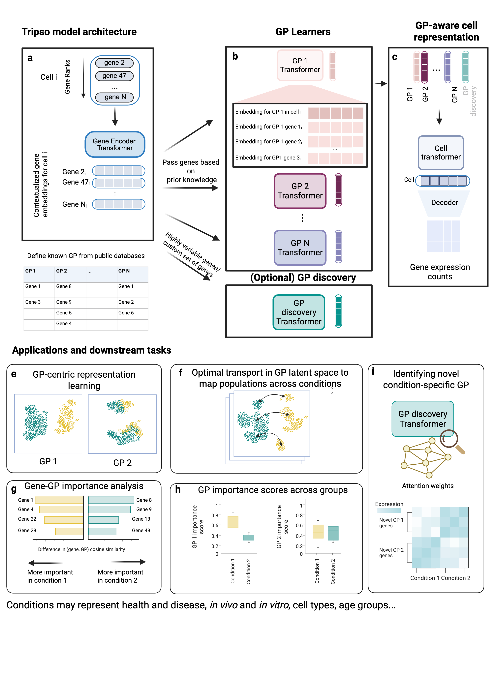

tripso
======

Welcome to the Tripso documentation! Tripso
(Transformers for learning Representations of Interpretable gene Programs
in Single-cell transcriptOmics), is a self-supervised framework
that decomposes cellular states into multiple GP embeddings.
Tripso learns contextualised gene embeddings within each GP,
quantifies gene-level contributions to each GP,
as well as this influence of each GP on global cell identity.

You will find links to tutorial scripts and installation instructions below.

.. toctree::
   :maxdepth: 1
   :caption: Getting Started

   getting-started/installation

.. toctree::
   :maxdepth: 1
   :caption: Tutorials

   getting-started/tutorials/00_prepare_data
   getting-started/tutorials/00.1_make_gpdb
   getting-started/tutorials/01_tokenize
   getting-started/tutorials/02_run_tripso
   getting-started/tutorials/03_run_tripso_eval
   getting-started/tutorials/04_visualize_embeddings
   getting-started/tutorials/05_calculate_gp_importance_scores
   getting-started/tutorials/06.1_generate_gp_gene_cosine_similarity
   getting-started/tutorials/06.2_visualize_gene_cosine_similarity
   getting-started/tutorials/07.1_run_gpdiscovery
   getting-started/tutorials/07.2_extract_novel_gp
   getting-started/tutorials/07.3_visualize_novel_gp

.. toctree::
   :maxdepth: 1
   :caption: Contributing

   contributing/docs

.. toctree::
   :maxdepth: 4
   :caption: Python API

   apidoc/tripso/tripso
